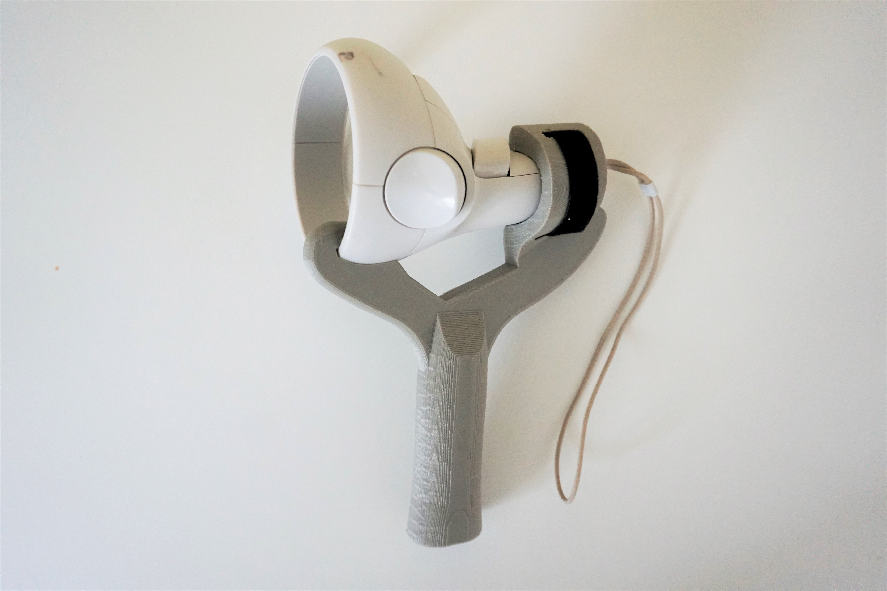

+++
author = "Davide Moscatelli"
title = "Puntata 1, Lo straordinario mondo della Realtà Virtuale"
date = "2021-07-21"
description = "Sostanzialmente è una realtà simualta che ha lo scopo di..."
tags = [
    "podcast",
    "passioni",
    "seconda puntata",
    "interessi",
    "realtà virtuale",
    "virtual reality",
    "vr",
    "oculus quest",
    "oculus",

]
categories = [
    "podcast",

]
series = ["Puntata podcast"]
aliases = ["logo-dm-podcast"]
image = "oculus-quest-copertina.jpg"
+++

Buongiorno Amici, come va la giornata e la vita?
A me devo dire abbastanza bene per ora.

Oggi parlo di realtà virtuale.
<!--more-->

## Che cos'è la realtà virtuale?

Sostanzialmente è una "realtà" simulata che ha lo scopo di offrire opportunità generalmente difficili o praticamente impossibili da replicare, nella vita di tutti i giorni.

Ad esempio operare un paziente a distanza, giocare a ping pong insieme ad un avversario che si trova dall'altra parte del mondo o  visitare l'antica Roma.

## La VR è alla portata di tutti

Nell'ambito dell'intrattenimento, sento troppo spesso persone dire che la realtà virtuale è una tecnologia acerba o  che è accessibile esclusivamente spendendo cifre esorbitanti.
Ora io mi chiedo, ma perché si parlasenza prima informarsi?

Hai mai sentito parlare di Oculus quest 2? No?
bene, l'oculus quest 2 è il visore prodotto da Facebook che non ha bisogno di un pc per funzionare ne tanto meno di cavi in giro per casa. Lo indossi ed hai subito accesso al mondo virtuale delle meraviglie. Il tutto senza spendere 1200 euro per il visore e 2000 euro di pc.

Il quest 2 costa 349 euro. 349 euro! meno di una console di nuova generazione.
Spendendo questa cifra avrai accesso ad esperienze come esplorazioni spaziali, immersioni subacquee, salvare l'umanità da una minaccia aliena, essere un detective o guardarti un bel film su Amazon prime direttamente in un cinema multi sala.

Durante questo periodo di pandemia, l'Oculus è stato fondamentale. Mi ha permesso di incontrare i miei amici e di conoscerne di nuovi senza dover impazzire chiuso in casa. Anzi forse ho visitato più posti rispetto allo standard degli anni precedenti.

## La qualità grafica non è tutto!

Un altro aspetto che ho dovuto affrontare con persone che parlano senza aver provato la tecnologica, riguarda la qualità delle texture e dei poligoni. “Eh ho visto su YouTube e la grafica è veramente imbarazzante”.

Ok sicuramente la maggior parte delle esperienze disponibili per VR non raggiungono la qualità grafica dei prodotti destinati ai pc o alle console, ma bisogna considerare un aspetto fondamentale, ovvero la profondità di campo.
Immagina di trovarti al centro di una stanza 10metri x 10metri. Quando guardi il muro davanti a te da un monitor (quindi con una visione 2D) potresti effettivamente notare texture di bassa risoluzione.
Essere invece virtualmente in quella stanza (quindi in uno spazio 3D) rende davvero difficile notare i dettagli su quel muro essendo realmente a 5/10 metri da te.

Ti svelo un altro segreto, bastano 2 minuti per farti dimenticare della qualità grafica quando sei immerso nell’azione. Pensa semplicemente di essere virtualmente in mezzo ad una sparatoria, devi magari accucciarti fisicamente per schivare i colpi o nasconderti dietro una rocca, caricare l’arma, mirare i nemici e sparare... non hai tempo per pensare devi soltanto agireeee!

Per farti capire ancora meglio … Quando faccio provare per la prima volta l’oculus ad una persona, solitamente avvio Ricky plank experience.
In sostanza con questa applicazione ti trovi in una città piena di grattacieli, sali in ascensore ed arrivi all’ultimo piano. Quando si aprono le porti ti trovi una tavola di legno sospesa nel vuoto. L’obiettivo è quello di camminarci sopra.

Considera ho visto persone con le gambe tremolanti per via dell'altezza, oppure avanzavano lungo la tavola mettendo un piede davanti all’altro. La cosa bella è che anche se dicevo loro di stare tranquilli, che potevano mettere i piedi in qualsiasi punto della stanza e che non c'era realmente nessun pericolo di caduta, loro continuavamo a fare attenzione ad ogni micro movimento. Tutto questo per dirvi che è un'esperienza sicuramente da provare, perché unica e perché trasmette emozioni forti.
Però, quando si tolgono il casco, la frase rimane sempre la stessa: "oh figata, ma quanto costa?".

**Facebook ecco la strategia perfetta per vendere il tuo visore... metti sparsi per l'italia degli stand che ti permetto di provare varie esperienze e appena se lo tolgono fagli trovare davanti alla faccia un bel pacco pronto per essere acquistato. FACEBOOK ASSUMIMI!**

Io ad esempio ultimamente mi sto appassionando al Ping pong. Con eleven table tennis, gioco dedicato al Ping pong per oculus quest e pc in vr, riesco a divertirmi come non mai facendo chiaramente movimento ed attività fisica.

Vi posso garantire che raggiunge un livello di realismo, soprattutto riguardo la fisica del rimbalzo della pallina e dell’effetto che posso imprimere alla stessa, fuori di testa. i controller del visore hanno un feedback aptico, nel senso che in funzione dell’azione che stai svolgendo restituiscono una vibrazione particolare. Ad esempio quando la racchetta colpisce la pallina, il controller vibra simulando l'impatto.

Inoltre mi sono stampato in 3D anche il supporto per il controller a forma di racchetta, per rendere il tutto più “croccante”.

Ho conosciuto persone da tutto il mondo ed imparato tecniche da asiatici veramente devastanti e qualche battuta da un francese decisamente socievole verso di me… un italiano…

## Il vero problema della realtà virtuale

sai qual è il vero problema del visore per la realtà virtuale? Che bisogna provarlo per capire cosa significa e che emozioni riesce a trasmettere.

Quindi o sei un fottuto jedi che ha le palle di combattere  la minaccia fantasma dell'insicurezza e ti compri un casco virtuale ad occhi chiusi o hai un amico come me che si diverte a veder camminare su una tavola le persone. Non esistono altri modi.

## Il mio consiglio
compratelo su Amazon, lascia stare per ora PS5 o Xbox.  Ci fai due partite e se non ti convince rimandatelo indietro (impossibile che succeda). Considera che i giochi che acquisterai sullo store oculus se provati per un tempo limitato possono essere tranquillamente rimborsabili.

Se hai bisogno di consigli o vuole semplicemente approfondire l'argomento, visita dmpodcast.it, lascia un commento sotto all'articolo o scrivimi in direct su Instagram.

Con questo ho terminato ci sentiamo alla prossima,

con Affetto DM.


